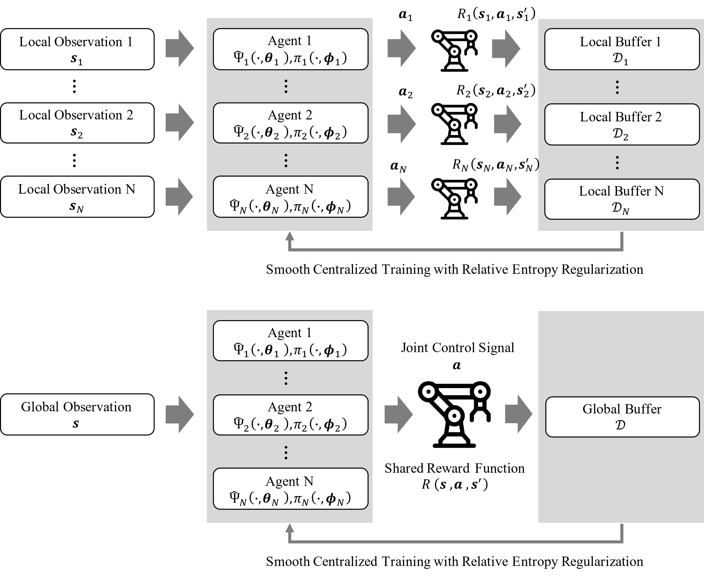

# Effective Multi-Agent Reinforcement Learning Control with Relative Entropy Regularization
Code for Paper "Effective Multi-agent Reinforcement Learning Control with Relative Entropy Regularization".
This paper is currently submitted to IEEE Transactions on Automation Science and Engineering (T-ASE) for peer review.

Please feel free to contact us regarding to the details of implementing MACDPP. (Chenyang Miao: cy.miao@siat.ac.cn Yunduan Cui: cuiyunduan@gmail.com)

## UR5 robot experiment display
You can see the peformance of MACDPP v.s. other RL algorithms with UR5 task in [our video in YouTube](https://www.youtube.com/watch?v=DhXboXt1pqU). Here we compared these algorithms in different stage interacting with environment.

## Experiment Config
Here we update two versions of the MACDPP code, one for the classic MPE tasks and another for the factorization tasks.

### MPE env
A simple multi-agent particle world based on gym. Please see [here](https://github.com/openai/multiagent-particle-envs) to install and know more about the environment.
For other dependencies, please refer to the requirements_mpe.txt.

### Robo-gym env
robo-gym is an open source toolkit for distributed reinforcement learning on real and simulated robots. You can see [here](https://github.com/jr-robotics/robo-gym) to install this env.
For other dependencies, please refer to the requirements_robo_gym.txt.

## Running Experiment
Experiment for a specific configuration can be run using:
``` python
python train.py --config
```
In the configs directory we upload the specific configurations of physical_deception task and End Effector Positioning task.

## Visualization
We use VisualDL, a visualization analysis tool of PaddlePaddle to realize the visualization of the exp process. 
